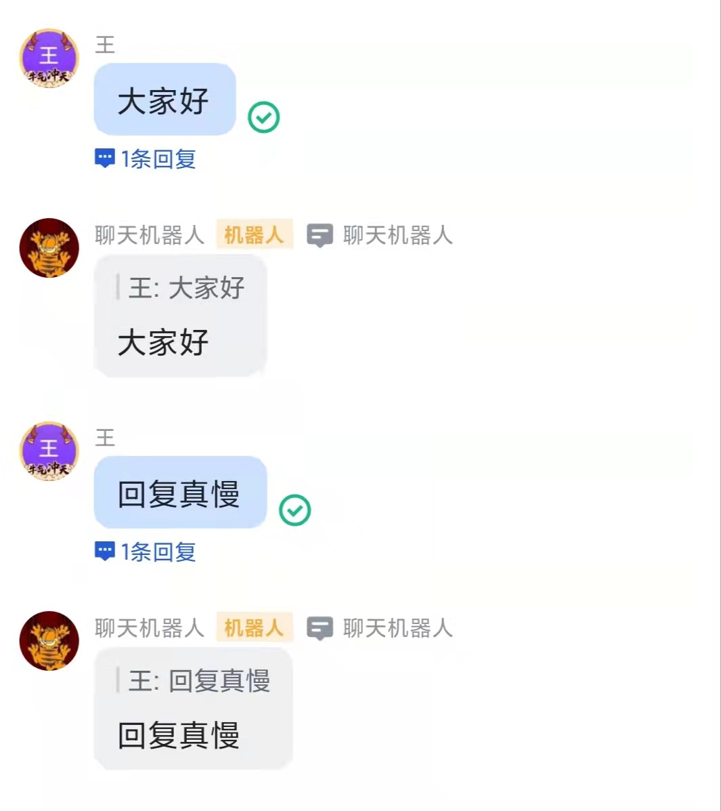

## 概览

该仓库是一个飞书机器人应用的服务端脚手架，你可以通过它直接编写自己的业务逻辑，而无需从头开始编写，从而快速开发出自己的飞书机器人应用。

## 说明

｜- main.go 服务启动文件 
｜- config.yaml 服务的配置文件，你可以将机器人的APP_ID等配置写在该文件中 
｜- event-app/ 服务api路由，所有的事件都会进入该文件夹的处理函数中，当你写完自己的事件处理函数时，需要在该服务处理函数中导入进行初始化注册 
｜- event-handle/ 事件处理函数，你需要编写自己的逻辑在此处 
｜- event-method/ 事件处理函数的注册地，所有的事件处理函数都需要在此处进行注册才能被使用 
｜- feishu/ 飞书服务端的各种API，可以直接调用进行发送 
｜- requests/ 底层请求处理函数 
｜- settings/ 读取配置文件函数 

## 机器人配置

获取机器人应用凭证APP_ID,APP_SECRET和事件订阅中的Verfication Token填入config.yaml文件； 
在部署好该服务后，在机器人“事件订阅”的“请求网址url”中填写“http://your_domain.com:8080/api/event/call_back”，其中的域名和监听端口号需要根据你服务端配置进行修改； 
在“权限管理”中添加必要的权限； 
在“事件订阅”中添加所需的事件； 

## 示例

该仓库的chat分支是一个简单的demo，当用户向机器人发送消息的时候（包括群组中的消息，只要能被机器人接收到即可），机器人会回复相同的消息回来。

